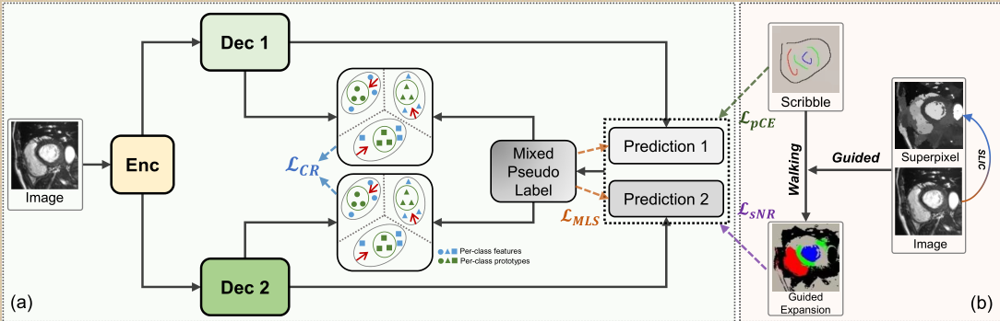

# SC-Net
# Weakly Supervised Medical Image Segmentation via Superpixel-guided Scribble Walking and Class-wise Contrastive Regularization

Pytorch implementation of our Weakly Supervised Medical Image Segmentation via Superpixel-guided Scribble Walking and Class-wise Contrastive Regularization. <br/>

## Paper
[Weakly Supervised Medical Image Segmentation via Superpixel-guided Scribble Walking and Class-wise Contrastive Regularization](https://github.com/Lemonzhoumeng/SC-Net) MICCAI 2023
<p align="center">
  
</p>

# Dataset
* The ACDC dataset with mask annotations can be downloaded from: [ACDC](https://www.creatis.insa-lyon.fr/Challenge/acdc/databases.html).
* The Scribble annotations of ACDC can be downloaded from: [Scribble](https://gvalvano.github.io/wss-multiscale-adversarial-attention-gates/data).
* The data processing code in [Here](https://github.com/Luoxd1996/WSL4MIS/blob/main/code/dataloaders/acdc_data_processing.py)  the pre-processed ACDC data in [Here](https://github.com/HiLab-git/WSL4MIS/tree/main/data/ACDC).

# Requirements
Some important required packages include:
* [Pytorch][torch_link] version >=0.4.1.
* TensorBoardX
* Python >= 3.6 
* Efficientnet-Pytorch `pip install efficientnet_pytorch`
* Some basic python packages such as Numpy, Scikit-image, SimpleITK, Scipy ......

Follow official guidance to install [Pytorch][torch_link].

[torch_link]:https://pytorch.org/

# Usage

1. Clone this project.
```
git clone https://github.com/Lemonzhoumeng/SC-Net
cd SC-Net
```
2. Data pre-processing or directly [download](https://github.com/HiLab-git/WSL4MIS/tree/main/data/ACDC) the pre-processed data.
```
cd code
python dataloaders/acdc_data_processing.py
```
3. Superpixel-guided Scribble Walking to augment the scribble labels
```
python add_super.py
```
Or download our augmented labels from [Google drive](https://drive.google.com/drive/folders/1AR-42jaJ_DXX2t9vYPU8T8dVn8Undum1?usp=drive_link).

4.  Train the model
```
python train_superpixel_dual_contrastive.py --fold {}
```

5. Test the model
```
python test_2D_contrastive_superpixel.py
```

## Acknowledgement
The code is modified from [WSL4MIS](https://github.com/HiLab-git/WSL4MIS). 

## Citation
 If you use this codebase in your research, please cite the following paper:

		@InProceedings{Zhou2023scnet,
		author={Meng Zhou, Zhe Xu, Kang Zhou, Kai-yu Tong},
		title={Weakly Supervised Medical Image Segmentation via Superpixel-guided Scribble Walking and Class-wise Contrastive Regularization},
		booktitle={MICCAI},
		year={2023}}

## Note
* If you have any questions, feel free to contact Meng at (1155156866@link.cuhk.edu.hk)
